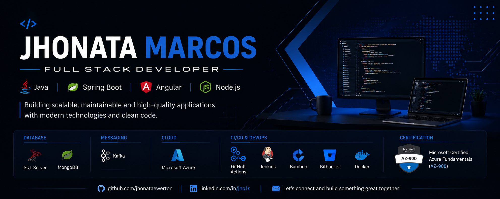

# 👋 Hi, I'm Jhonata Marcos

### Full Stack Developer

### **Angular • Spring Boot • Node.js**

---

# 👨🏻‍💻 About Me

I'm a **Full Stack Developer** with a strong focus on **Angular** and modern frontend development.

Over the past few years, I've been building enterprise applications using Angular, TypeScript and REST APIs while also developing backend services with Java, Spring Boot and Node.js.

I enjoy creating intuitive user experiences, designing scalable architectures and continuously improving code quality through clean code, software architecture and modern development practices.

---

# 🚀 Main Expertise

- 🅰️ Enterprise Angular Applications
- ⚙️ REST APIs
- 🔐 Authentication & Authorization
- 🧩 Microfrontends
- 🎨 Component-based Architecture
- ☕ Spring Boot
- 🟢 Node.js
- ☁️ Azure
- 🔄 CI/CD Pipelines

---

# 🅰️ Frontend

**Primary Stack**

- Angular
- TypeScript
- JavaScript (ES6+)
- HTML5
- SCSS
- Angular Material
- RxJS
- Responsive Design

---

# ⚙️ Backend

- Java
- Spring Boot
- Spring Security
- Node.js
- REST APIs
- OpenAPI / Swagger
- Apache Kafka

---

# 🗄 Databases

- SQL Server
- MongoDB

---

# ☁️ Cloud & DevOps

- Microsoft Azure
- Azure Fundamentals (AZ-900)
- Docker
- CI/CD
- GitHub Actions
- Jenkins
- Bamboo
- Bitbucket

---

# 🧪 Testing

---

# 🏅 Certification

✅ Microsoft Certified: Azure Fundamentals (AZ-900)

---

# 📊 GitHub Analytics

---

---

---

---

# 🌱 Current Focus

- Advanced Angular
- Software Architecture
- Cloud Solutions
- Azure
- Distributed Systems
- Performance Optimization

---

# 📫 Let's Connect

---

## ⭐ "First, solve the problem. Then, write the code."

Thanks for visiting my profile!

